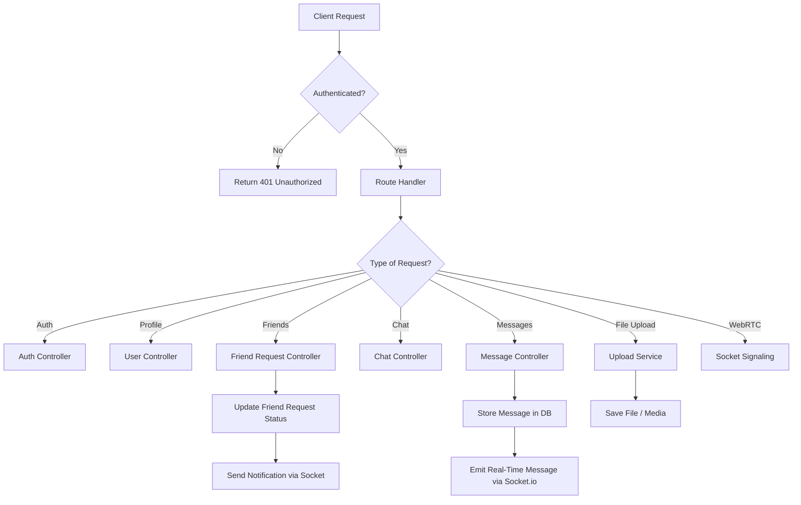

# 🛠️ Streamify – Backend (Node.js)

A powerful **Node.js + Express** backend that powers the entire Streamify language‑learning chat platform. It provides **authentication**, **chat APIs**, **video call signaling**, **file handling**, **real‑time messaging**, and **social features**.

This README covers **architecture**, **APIs**, **database structure**, **real‑time flow**, and a **full backend flowchart**.

---

## 🚀 Features (Backend)

### 🔐 Authentication

* Sign Up / Sign In
* Password hashing
* JWT‑based authentication
* Auth middleware

### 👤 User & Profile System

* Create user
* Store onboarding data
* Update profile
* Get user details

### 👫 Friends & Requests

* Send friend request
* Accept friend request
* Reject / cancel request
* Fetch friends list

### 💬 Chat & Messaging

* Create conversations
* Store messages
* Support text, images, documents
* Fetch chat history

### ⚡ Real‑Time Communication

* **Socket.io** for:

  * Live messages
  * Typing indicators
  * Online/offline status
  * Notification delivery

### 🎥 Video Call Signaling

* WebRTC signaling through Socket.io
* Call request
* Call accept/reject
* ICE candidate exchange

### 📦 File Handling

* Upload media/documents
* Static file serving

---

## 📁 Project Structure (Backend)

```
/backend
 ├── src
 │    ├── controllers
 │    ├── routes
 │    ├── middleware
 │    ├── models
 │    ├── sockets
 │    ├── utils
 │    └── config
 ├── uploads
 ├── package.json
 └── server.js / app.js
```

---

## 🗄️ Database Schema Overview

(Example using MongoDB + Mongoose)

### **Users**

* name
* email
* password
* avatar
* theme
* onboardingCompleted

### **Friend Requests**

* fromUser
* toUser
* status

### **Messages**

* chatId
* senderId
* text / fileUrl
* messageType
* timestamps

### **Chats**

* members[]
* lastMessage

---

## 🔄 Backend Workflow (Complete Flowchart)



---

## 🔧 Tech Stack (Backend)

* **Node.js**
* **Express.js**
* **Socket.io**
* **MongoDB + Mongoose** / SQL (depending on your version)
* **JWT Authentication**
* **Bcrypt** for password hashing
* **Multer** for file uploads
* **WebRTC Signaling**

---

## 📡 Important Endpoints

### **Auth**

* POST `/auth/signup`
* POST `/auth/login`

### **User**

* GET `/user/me`
* PUT `/user/update`

### **Friends**

* POST `/friends/request`
* PUT `/friends/accept`
* GET `/friends/list`

### **Chat**

* POST `/chat/start`
* GET `/chat/:id/messages`

### **Messages**

* POST `/message/send`

### **Uploads**

* POST `/upload/file`

---

## ⚡ Real‑Time (Socket Events)

### **User Events**

* `user:online`
* `user:offline`

### **Chat Events**

* `message:send`
* `message:receive`
* `typing:start`
* `typing:stop`

### **Call Events**

* `call:initiate`
* `call:accept`
* `call:reject`
* `call:ice-candidate`

---

## ▶️ How to Run (Backend)

```
npm install
npm run dev
```

---

## 📦 Production Build

```
npm run build
npm start
```

---

## 🎯 Summary

The Streamify backend provides:

* **Full authentication system**
* **Real‑time messaging & video calls**
* **Friend management**
* **Chat storage & document handling**
* **Scalable Node.js architecture**

This backend seamlessly supports the entire Streamify ecosystem.

---
